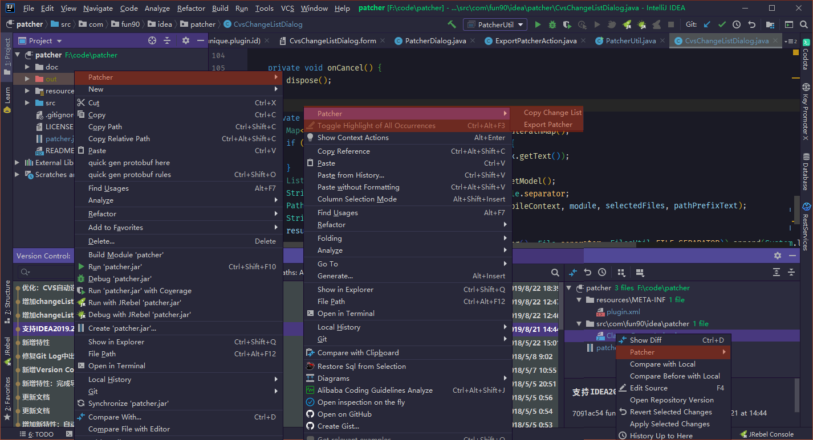

## 一、介绍

1. Patcher是一款导出增量补丁文件的IDEA插件，为开发者省去了很多繁琐操作。
2. 建议IDEA版本升级至2017或2017以上版本。

感谢：https://github.com/serical/patcher

更新日志：

1. 2017-05-04 新增特性：如果工程只有一个Module则自动选中，无需再手动选择。
2. 2017-05-05 新增特性：自动编译后再导出
3. 2017-05-05 新增特性：完成导出后通知消息加入打开导出文件夹
4. 2017-05-07 新增Version Control面板中SVN Repository右键菜单
5. 2017-05-15 新增Version Control面板Local Changes右键菜单
6. 2017-05-22 新增删除已存在文件选项，勾选则在导出前删除到已存在的文件
7. 2019-08-23 支持Idea 2019.2，新增复制change list，优化自动选择module

界面预览：

## 二、安装

