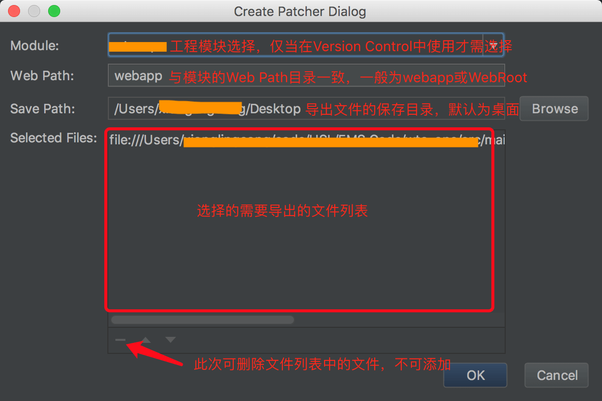
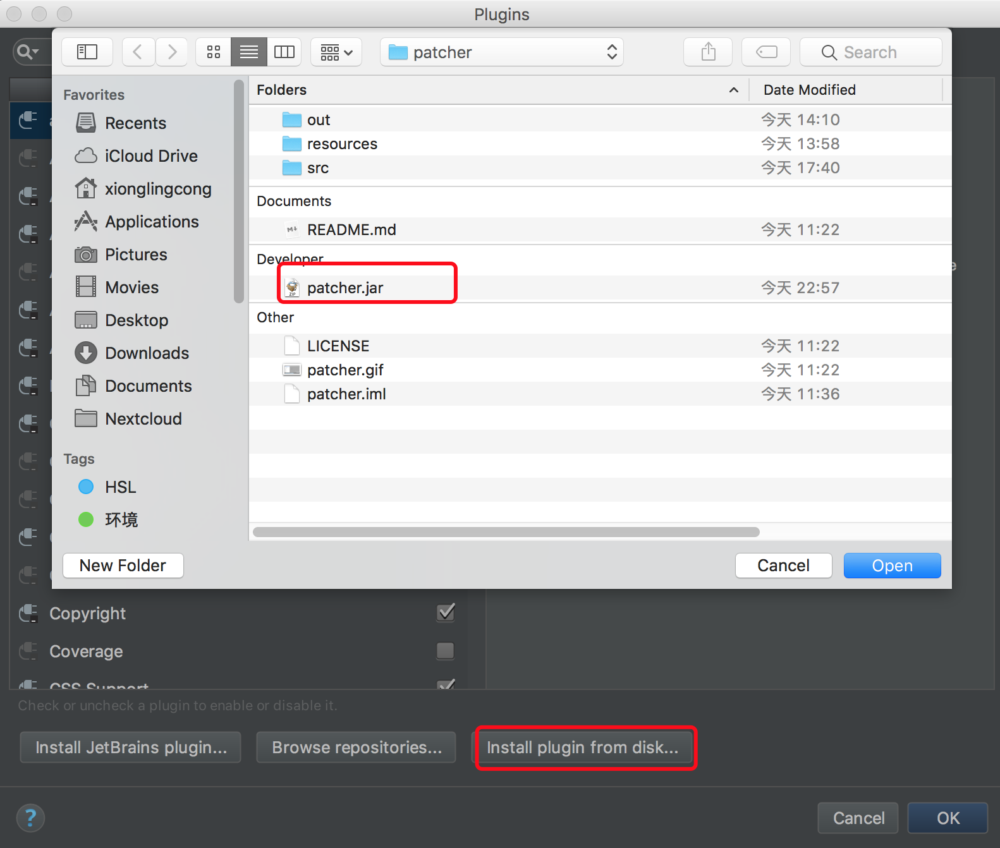
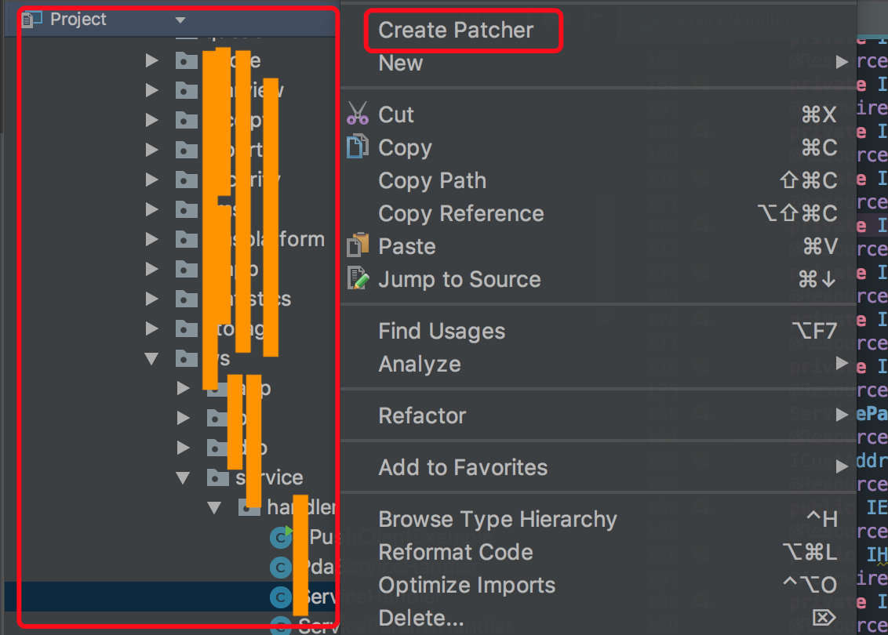
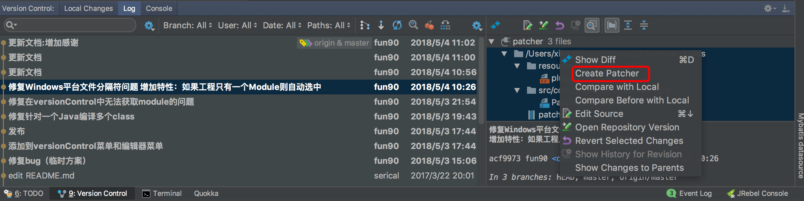

## 一、介绍

1. Patcher是一款导出增量补丁文件的IDEA插件，为开发者省去了很多繁琐操作。
2. 建议IDEA版本升级至2017或2017以上版本。

感谢：https://github.com/serical/patcher

更新日志：

1. 2017.5.4 新增特性：如果工程只有一个Module则自动选中，无需再手动选择。
2. 2017.5.5 新增特性：自动编译后再导出
3. 2017.5.5 新增特性：完成导出后通知消息加入打开导出文件夹
4. 2017.5.7 新增Version Control SVN Repository右键菜单

界面预览：

## 二、安装

## 二、使用

**有三处地方可以增量导出文件**

第1处：左侧Project文件栏选择文件或目录后右击鼠标（无需选Module）

第2处：文本编辑器内右击鼠标（无需选Module）

第3处：Version Control面板的Log（推荐使用，需要选Module，只支持IDEA 2017及以上版本）

